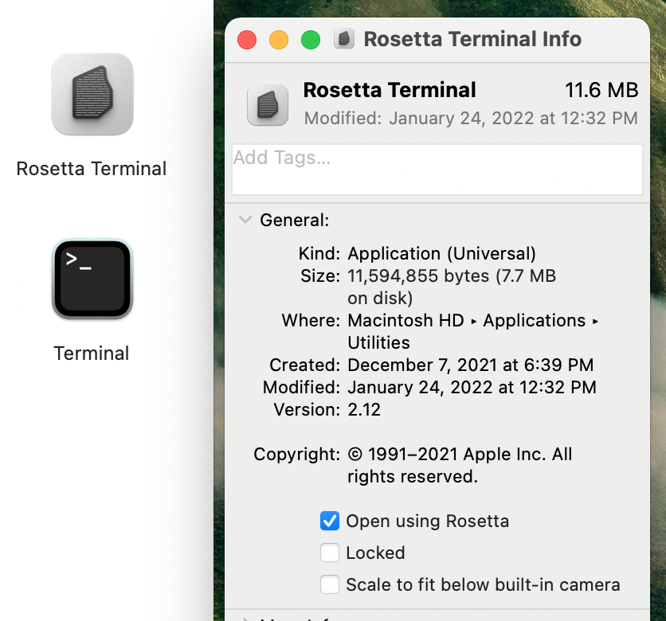

# Intro

This guide shows you how I like to setup my Macbook Pro (M1/Apple Silicon) machine to be productive as a developer for work as well as for personal projects. Hope it will be useful to you as well.

# Creating a SSH Key

Hopefully you already have a pair of public/private keys generated, if not, GitHub provides a very good guide on how to create a new SSH key and updating your local `~/.ssh/config`.

I highly recommend using this [Generating a new SSH key and adding it to the ssh-agent](https://docs.github.com/en/authentication/connecting-to-github-with-ssh/generating-a-new-ssh-key-and-adding-it-to-the-ssh-agent) guide and then following this [Adding a new SSH key to your GitHub account](https://docs.github.com/en/authentication/connecting-to-github-with-ssh/adding-a-new-ssh-key-to-your-github-account) to install the SSH Key.

GitHub is also a nice place to store your public/private projects.

# Arm64 & x86-64 Terminals

While things are transitioning from the x86-64 cpu architecture to Arm64 (AArch64) you will run into situations where you need to run apps in x86-64 mode. While less ideal, the Rosetta 2 technology is trying to make this as painless as possible.

A thing I like to do is having separate terminal apps to run apps. You can do so to:
- Open up **Finder** and go to the **Applications** folder.
- In the **Utilities** folder copy the **Terminal** app and call it something like **Rosetta Terminal**.
- Right-click the **Rosetta Terminal** app and click on **Get info**.
- Check **Open using Rosetta**
- Optionally you can change the app icon
- 

Now, when you open up the terminal, the app icon can help but you can use this trick to make it even more clear:
- open up your `.zshrc` file and add this at the end:

        # Show Terminal architecture
        echo "**********"
        echo -n "* "; uname -m
        echo "**********"

- Next time you open either terminal it will tell you if you're in `arm64` or `x86_64` mode 

# XCode(s)

Don't install XCode via the AppStore unless:

* You don't mind waiting hours for it to install
* You don't mind an overnight automatic upgrade and realizing you're suppose to ship something that morning.

A better way is to go to the Apple Developer website and manually download the version you like to use.
* https://developer.apple.com/download/all/

An even more convenient way is to use XCodes (either the app or the commandline tool):
* https://github.com/RobotsAndPencils/XcodesApp

You will need an Apple developer account but it installs XCode faster than the above methods, allows you to install multiple versions and make them active as needed.

# Homebrew

If you're on a mac, you should use Homebrew as a package manager, it's great (in my opinion).

Install is super easy, just follow the guide:
* https://brew.sh

# Java / OpenJDK

For [Android development](https://developer.android.com/) you probably will need a JDK. You could use the embedded one or [Azul Zulu OpenJDK](https://www.azul.com/downloads/?version=java-11-lts&os=macos&package=jdk) is a great alternative (especially if you plan to do some KMM or Java development).

The link above will take you to the `Java 11 (LTS)` version. Select `macOS`, `ARM64-bit` and the `JDK`. Download the dmg & install.

# Python

Don't use the pre-installed Python build of your mac. Get a something newer using `pyenv`.

Follow these instructions to install pyenv: 
* https://github.com/pyenv/pyenv#installation

## Install a Python version and make it globally available:

    pyenv install 3.9.10
    pyenv global 3.9.10

List of versions: https://www.python.org/doc/versions/

# Ruby

Don't use the pre-installed Ruby build. Get a something newer using rbenv. 

Follow these instructions to install rbenv: 
* https://github.com/rbenv/rbenv#installation

## Install a Ruby version and make it globally available:

    rbenv install 2.6.9
    rbenv global 2.6.9

    lmuller@retro ~ % ruby --version
    ruby 2.6.9p207 (2021-11-24 revision 67954) [arm64-darwin21]

## For iOS development:

* [Bundler](https://bundler.io/)

        gem install bundler

* [Cocoapods](https://cocoapods.org/) a dependency manager for Swift / Objective-C cocoa projects.

        gem install cocoapods

* [Fastlane](https://fastlane.tools/) installed via the Bundler, requires you to install Ruby
    * https://docs.fastlane.tools/getting-started/ios/setup/

# Node.js

While you can install node from https://nodejs.org/en/ using nvm is easier and allows you to switch between different versions (similar to rbenv/pyenv).

Follow these instructions: 
* https://github.com/nvm-sh/nvm#installing-and-updating

# Docker

Follow 🐳: 
* https://www.docker.com/get-started
* Get Docker Desktop and pick the right architecture: Mac Apple Chip

# JetBrains Toolbox

If you are going to use `Android Studio`, `IntelliJ IDEA`, `PyCharm`, `DataGrip`, `WebStorm` etc, it's much easier to install it through the [JetBrains Toolbox](https://www.jetbrains.com/toolbox-app/). It will allow you to install multiple versions side by side and makes updating a breeze.

# Visual Studio Code

A great editor: https://code.visualstudio.com

# Sourcetree

Sometimes it's nicer to use one app to manage all your repos: https://www.sourcetreeapp.com

# Notes

Other tools/apps I use:
* https://folivora.ai/bettersnaptool
* https://bjango.com/mac/istatmenus/
* https://signal.org/en/download/
* https://brave.com/
* https://bitwarden.com/
* https://www.texstudio.org/
* https://tunnelblick.net/
